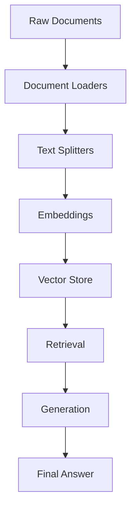

import { IconBrain, IconDatabase, IconSearch, IconRobot } from '@tabler/icons-react';

# 🚀 Getting Started with LangChain and ChromaDB for RAG

<div style={{ textAlign: 'center', margin: '2rem 0', padding: '1.5rem', backgroundColor: 'var(--catppuccin-surface0)', borderRadius: '12px', border: '1px solid var(--catppuccin-surface1)' }}>
  <h2 style={{ margin: '0 0 0.5rem 0', color: 'var(--catppuccin-blue)' }}>🎯 Build Intelligent RAG Systems</h2>
  <p style={{ margin: '0', color: 'var(--catppuccin-text)' }}>
    Master the fundamentals of Retrieval-Augmented Generation with LangChain and ChromaDB
  </p>
</div>

## What is RAG?

**Retrieval-Augmented Generation (RAG)** is a technique that enhances Large Language Models by providing them with relevant context from external knowledge sources. Instead of relying solely on the model's training data, RAG systems retrieve relevant information and use it to generate more accurate and contextually appropriate responses.

### Why RAG Matters

- **Reduced Hallucinations**: Ground responses in factual data
- **Domain Expertise**: Access specialized knowledge bases
- **Real-time Information**: Include up-to-date information
- **Cost Effective**: Avoid retraining large models

## Core Components

### LangChain 🦜

LangChain is a framework for developing applications powered by language models. It provides:

- **Document Loaders**: Import data from various sources
- **Text Splitters**: Divide documents into manageable chunks
- **Embeddings**: Convert text to vector representations
- **Vector Stores**: Store and retrieve embeddings
- **Chains**: Combine multiple components

### ChromaDB 🗄️

ChromaDB is a vector database specifically designed for AI applications:

- **Simple API**: Easy to use and integrate
- **Fast Retrieval**: Optimized for similarity search
- **Metadata Filtering**: Advanced query capabilities
- **Persistent Storage**: Save and load databases
- **Cloud Ready**: Scalable deployment options

## Setting Up Your Environment

### Installation

```bash
# Create a new Python project
mkdir langchain-chromadb-rag
cd langchain-chromadb-rag
python -m venv venv
source venv/bin/activate  # On Windows: venv\Scripts\activate

# Install dependencies
pip install langchain chromadb openai tiktoken pypdf unstructured
```

### Environment Variables

```bash
# Create .env file
OPENAI_API_KEY=your_openai_api_key_here
```

## Building Your First RAG System

### Step 1: Document Loading

```python
from langchain.document_loaders import PyPDFLoader, WebBaseLoader
from langchain.text_splitter import RecursiveCharacterTextSplitter

# Load documents
pdf_loader = PyPDFLoader("data/company_handbook.pdf")
web_loader = WebBaseLoader("https://company-website.com/docs")

documents = []
documents.extend(pdf_loader.load())
documents.extend(web_loader.load())

print(f"Loaded {len(documents)} documents")
```

### Step 2: Text Splitting

```python
# Split documents into chunks
text_splitter = RecursiveCharacterTextSplitter(
    chunk_size=1000,
    chunk_overlap=200,
    length_function=len,
)

texts = text_splitter.split_documents(documents)
print(f"Created {len(texts)} text chunks")
```

### Step 3: Vector Embeddings

```python
from langchain.embeddings import OpenAIEmbeddings

# Initialize embeddings
embeddings = OpenAIEmbeddings(
    model="text-embedding-ada-002",
    openai_api_key=os.getenv("OPENAI_API_KEY")
)

# Test embedding
test_embedding = embeddings.embed_query("Hello world")
print(f"Embedding dimension: {len(test_embedding)}")
```

### Step 4: Vector Store Setup

```python
from langchain.vectorstores import Chroma
import chromadb

# Initialize ChromaDB client
client = chromadb.PersistentClient(path="./chroma_db")

# Create vector store
vectorstore = Chroma.from_documents(
    documents=texts,
    embedding=embeddings,
    client=client,
    collection_name="company_docs"
)

print("Vector store created successfully!")
```

### Step 5: Retrieval and Generation

```python
from langchain.llms import OpenAI
from langchain.chains import RetrievalQA
from langchain.prompts import PromptTemplate

# Initialize LLM
llm = OpenAI(
    model_name="gpt-3.5-turbo",
    temperature=0,
    openai_api_key=os.getenv("OPENAI_API_KEY")
)

# Create retrieval chain
qa_chain = RetrievalQA.from_chain_type(
    llm=llm,
    chain_type="stuff",
    retriever=vectorstore.as_retriever(search_kwargs={"k": 3}),
    return_source_documents=True
)

# Test the system
query = "What is our company vacation policy?"
result = qa_chain({"query": query})

print("Question:", query)
print("Answer:", result["result"])
print("Sources:", [doc.metadata for doc in result["source_documents"]])
```

## Understanding the RAG Pipeline

### Document Processing Pipeline



### Key Components Explained

#### Document Loaders
- **PyPDFLoader**: Load PDF documents
- **WebBaseLoader**: Scrape web pages
- **DirectoryLoader**: Load entire directories
- **TextLoader**: Load plain text files

#### Text Splitters
- **RecursiveCharacterTextSplitter**: Smart splitting based on document structure
- **CharacterTextSplitter**: Simple character-based splitting
- **TokenTextSplitter**: Split based on token count

#### Embeddings
- **OpenAIEmbeddings**: High-quality embeddings from OpenAI
- **HuggingFaceEmbeddings**: Open-source alternatives
- **CohereEmbeddings**: Enterprise-grade embeddings

## Advanced Configuration

### Custom Embedding Function

```python
from langchain.embeddings.base import Embeddings
from sentence_transformers import SentenceTransformer

class CustomEmbeddings(Embeddings):
    def __init__(self, model_name="all-MiniLM-L6-v2"):
        self.model = SentenceTransformer(model_name)

    def embed_documents(self, texts):
        return self.model.encode(texts).tolist()

    def embed_query(self, text):
        return self.model.encode([text])[0].tolist()
```

### ChromaDB Configuration

```python
import chromadb
from chromadb.config import Settings

# Advanced ChromaDB configuration
client = chromadb.PersistentClient(
    path="./chroma_db",
    settings=Settings(
        anonymized_telemetry=False,
        allow_reset=True,
    )
)

# Create collection with metadata
collection = client.get_or_create_collection(
    name="company_docs",
    metadata={
        "description": "Company documentation and policies",
        "created": "2024-01-17"
    }
)
```

## Testing Your RAG System

### Evaluation Metrics

```python
def evaluate_rag_system(queries, ground_truth_answers):
    results = []

    for query, expected in zip(queries, ground_truth_answers):
        # Get RAG response
        response = qa_chain.run(query)

        # Calculate metrics
        relevance_score = calculate_relevance(response, expected)
        accuracy_score = calculate_accuracy(response, expected)

        results.append({
            "query": query,
            "response": response,
            "relevance": relevance_score,
            "accuracy": accuracy_score
        })

    return results
```

### Common Testing Queries

```python
test_queries = [
    "What are our core company values?",
    "How do I request time off?",
    "What is the dress code policy?",
    "How does performance review work?",
    "What benefits do we offer?"
]
```

## Troubleshooting Common Issues

### Embedding Dimension Mismatch

```python
# Check embedding dimensions
collection = client.get_collection("company_docs")
print("Collection count:", collection.count())

# Reset if needed
client.reset()
```

### Memory Issues

```python
# Process documents in batches
def process_documents_batch(documents, batch_size=100):
    for i in range(0, len(documents), batch_size):
        batch = documents[i:i + batch_size]
        # Process batch
        vectorstore.add_documents(batch)
```

### API Rate Limits

```python
import time
from langchain.embeddings import OpenAIEmbeddings

class RateLimitedEmbeddings(OpenAIEmbeddings):
    def embed_documents(self, texts, chunk_size=100):
        results = []
        for i in range(0, len(texts), chunk_size):
            chunk = texts[i:i + chunk_size]
            results.extend(super().embed_documents(chunk))
            time.sleep(1)  # Rate limiting
        return results
```

## Best Practices

### Document Preparation
- Clean and preprocess text before embedding
- Use appropriate chunk sizes (500-2000 characters)
- Include metadata for better filtering
- Consider document structure and hierarchy

### Vector Store Optimization
- Choose appropriate similarity metrics
- Implement metadata filtering
- Use appropriate indexing strategies
- Monitor query performance

### Production Considerations
- Implement caching strategies
- Use connection pooling
- Monitor system performance
- Plan for scalability

## Next Steps

Now that you have a basic RAG system running, explore:

1. **Advanced Retrieval**: Implement hybrid search, re-ranking, and query expansion
2. **Multi-modal RAG**: Add support for images, audio, and video
3. **Conversational RAG**: Build chatbots with memory and context
4. **Production Deployment**: Containerize and deploy your RAG system

## Resources

- [LangChain Documentation](https://python.langchain.com/)
- [ChromaDB Documentation](https://docs.trychroma.com/)
- [OpenAI Embeddings Guide](https://platform.openai.com/docs/guides/embeddings)
- [RAG Best Practices](https://www.pinecone.io/learn/retrieval-augmented-generation/)

Happy building! 🚀
